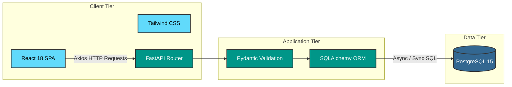
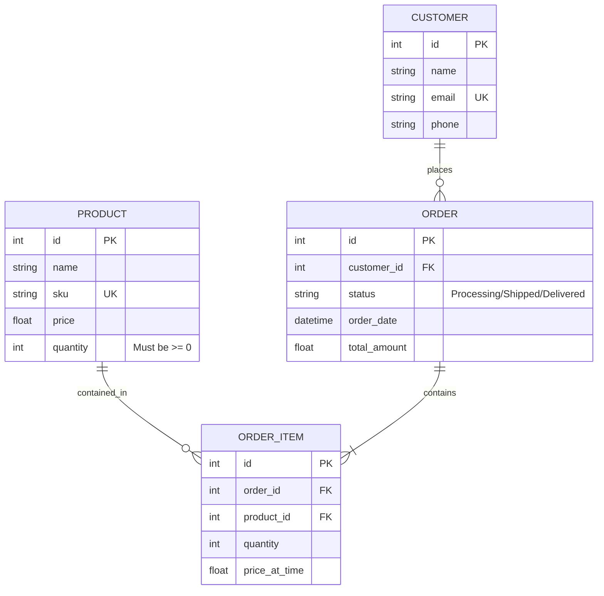

<div align="center">
  <br />
  <h1>GlassFlow ✦ Enterprise Inventory & Order Management</h1>

  <p><strong>A production-grade, full-stack ERP system wrapped in a modern glassmorphism UI.</strong></p>

  <a href="https://reactjs.org/"></a>
  <a href="https://fastapi.tiangolo.com/"></a>
  <a href="https://www.postgresql.org/"></a>
  <a href="https://www.docker.com/"></a>
  <a href="https://glassflow-inventory.vercel.app"></a>
</div>

<br />

> **Live Demo:** [https://glassflow-inventory.vercel.app](https://glassflow-inventory.vercel.app)

GlassFlow is a highly-performant, robust SaaS platform designed to streamline operations for e-commerce and retail businesses. Built with a focus on scalability and developer experience, it provides real-time inventory tracking, complex order fulfillment logic, and customer directory management.

---

## 🏗️ System Architecture

GlassFlow utilizes a decoupled, microservices-ready architecture relying on a RESTful API communication bridge.



---

## 🗄️ Database Schema

The database relies on strict relational integrity, enforcing business rules directly at the schema level to prevent data anomalies.



---

## ✨ Enterprise Features

### 📦 Smart Inventory Control
- **Atomic Operations:** Prevents race conditions during simultaneous order placements.
- **Strict Validation:** Database-level `CHECK` constraints strictly prevent negative stock quantities.
- **Proactive Alerts:** Algorithmic detection of low-stock thresholds, rendered dynamically on the analytics dashboard.

### 💳 Order Fulfillment Engine
- **Automated Ledger:** Automatically deducts product stock upon order creation and safely restores stock upon cancellation.
- **Historical Accuracy:** Line items capture the `price_at_time`, shielding historical financial data from future product price changes.
- **Relational Integrity:** Strict cascading rules ensure orphaned records cannot exist in the system.

### 🎨 Premium User Experience
- **Custom Design System:** Developed a custom CSS token system leveraging Tailwind CSS for beautiful frosted-glass effects (Glassmorphism).
- **100% Responsive & Optimized:** Flawless mobile rendering with heavily optimized Largest Contentful Paint (LCP) performance and zero Cumulative Layout Shift (CLS).
- **Optimistic UI:** Instantaneous state reflections mapped to asynchronous background API interactions.

---

## 🚀 Quick Start & Deployment

The application is fully containerized ensuring deterministic builds across all environments.

### Prerequisites
- [Docker](https://docs.docker.com/get-docker/) & Docker Compose
- Git

### 1. Local Environment Setup

```bash
# Clone the repository
git clone https://github.com/yourusername/GlassFlow.git
cd GlassFlow

# Copy the environment template
cp .env.example .env
```

### 2. Bootstrapping the Platform

Run the following command to download images, build the custom layers, and spin up the PostgreSQL, FastAPI, and React containers.

```bash
docker compose up --build -d
```

### 3. Seeding the Database (Optional)
To populate the database with realistic test data (including randomized order states and localized names for UI testing):

```bash
docker compose exec backend python seed.py
```

### 4. Accessing the Infrastructure

| Service | Address | Description |
|---|---|---|
| **Frontend UI** | `http://localhost:80` | The React SPA application |
| **Backend API** | `http://localhost:8000/docs` | Interactive Swagger/OpenAPI documentation |
| **Health Check**| `http://localhost:8000/health` | Infrastructure heartbeat endpoint |

---

## 🔐 Environment Configuration

The system is configured via environment variables injected at runtime. 

| Variable | Description | Default Value |
|---|---|---|
| `POSTGRES_USER` | Database superuser account | `postgres` |
| `POSTGRES_PASSWORD` | Secure database password | `postgres` |
| `POSTGRES_DB` | Primary database name | `glassflow` |
| `DATABASE_URL` | Composed connection string | *(Auto-generated in docker-compose)* |
| `VITE_API_URL` | API proxy for the React client | *(Derived dynamically)* |

---

## 🛠️ Tech Stack & Tooling

- **Frontend:** React 18, Vite, Tailwind CSS, Axios, Lucide Icons, React Router DOM.
- **Backend:** Python 3.10+, FastAPI, SQLAlchemy ORM, Pydantic, Uvicorn.
- **Database:** PostgreSQL 15.
- **DevOps/Infra:** Docker, Docker Compose, Nginx, Vercel (CI/CD Pipeline).

---

<div align="center">
  <p>Engineered with dedication and precision. Built for scale.</p>
  <p><b>© 2026 GlassFlow</b></p>
</div>
